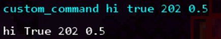

# 自定义命令

命令系统是 `Monocle` 内置的调试工具, 可以通过调试控制台快速执行操作.

!!!info
    这里的调试控制台不是蔚蓝游戏窗口外那个单独打开的黑色控制台, 而是在蔚蓝内按下 ++grave++, 也就是数字键 ++1++ 左边那个打开的.     
    此外还需要在 `Mod 选项` 里找到 `Everest Core`, 并把 `调试模式` 切换为 `开`.

    后续<del>为了偷懒</del>会使用 `控制台` 指代 `调试控制台`.

## CommandAttribute

我们可以通过 `[Command]` 特性标记静态方法为一条命令:

```cs
[Command("custom_command", "This is a custom command!")]
public static void CustomCommand()
{
    Engine.Commands.Log("wow");
}
```

`Command(string name, string help)` 特性有两个参数:

* `name`: 命令的标识符.
* `help`: 在控制台执行 `help <name>` 会输出的内容, 比如执行 `help custom_command` 会输出 `This is a custom command!`.

可以通过 `Engine.Commands.Log` 向控制台输出内容, 参数是 `object obj, Color color = Color.White`.        
`obj` 是我们希望输出的内容, `color` 是输出内容的颜色, 默认为白.        

!!!info
    虽然第一个参数类型是 `object`, 但通常传入 `string` 就可以, 方法内部会调用 `obj.ToString()` 转换为字符串.

完成后我们就可以在控制台执行了:  


!!!info
    可以使用 ++tab++ 补全命令.

## 参数

我们也可以通过控制台向命令提供参数, 这需要在命令的参数列表中定义:
```cs
[Command("custom_command", "This is a custom command!")]
public static void CustomCommand(string str, bool boolean, int num1, float num2)
{
    Engine.Commands.Log($"{str} {boolean} {num1} {num2}");
}
```

命令可接受的参数类型有 `string`, `bool`, `int` 与 `float`. 在控制台中提供只需要在输入命令的标识符后以空格分隔输入就可以.

!!!info
    如果在输入命令时没有提供所需的参数, 会使用类型的默认值.         
    此外对于 `bool` 类型的参数, 只有转换为小写内容为 `0`, `false`, `f` 会被视为 `false`, 其他内容都视为 `true`.

比如执行下面的命令会输出:



## 示例

这里有一些自定义命令的示例:

这个命令可以强制跳过当前过场动画, 即使禁用了暂停或暂停选项中的跳过剧情动画:
```cs
[Command("skip_cutscene", "Force skip current cutscene")]
public static void ForceSkipCutscene()
{
    if (Engine.Scene is not Level level)
    {
        Engine.Commands.Log("Not in level");
        return;
    }

    level.SkipCutscene();
}
```

可以在一些场景使用, 比如<del>不幸参加逆旅的神秘成语大会</del>:


这个命令可以设置玛德琳的亚像素:
```cs
[Command("set_subpixel", "Set Madeline's subpixel x and y, range is [0, 1]")]
public static void SetSubpixel(float x, float y)
{
    if (Engine.Scene is not Level level)
    {
        Engine.Commands.Log("Not in level");
        return;
    }

    Player player = level.Tracker.GetEntity<Player>();
    if (player == null)
    {
        Engine.Commands.Log("Player not found");
        return;
    }

    player.movementCounter = new Vector2(x - 0.5f, y - 0.5f);
}
```