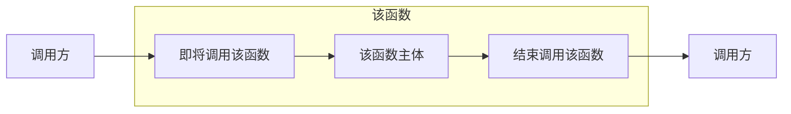
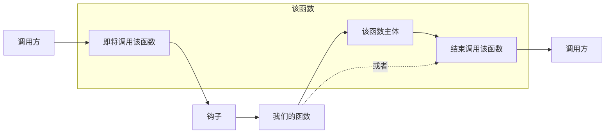
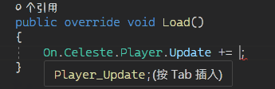
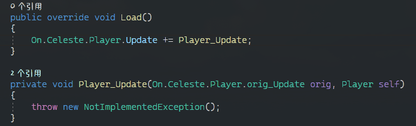

# On 钩子

对于 C# 的一个普通的函数来说, 它被调用时看起来是这样的:

```csharp
void Method(){}  // 原函数(不可随意修改)

void Caller()  // 调用方
{
    Method();
}

```


当我们引入钩子技术后, 这个函数调用时会像被"钩"住一样转身去调用我们的函数:

=== "一个Hook"
    ```csharp
    void Method(){}  // 原函数(不可随意修改)
    
    void Hook(Action method){}  // 我们的函数(可随意修改), 可以任意操控method的调用时机甚至不调用
    
    void Caller()  // 调用方
    {
        Hook(Method);
    }
    
    ```
=== "多个Hook"
    ```csharp
    void Method(){}
    
    void Hook(Action method){}

    void Hook1(Action hook){ Hook(Method) }  // 不断套娃, 后续我们对蔚蓝代码的hook也是类似的
    
    void Caller()  // 调用方
    {
        Hook1(Hook);
    }
    
    ```



如图所见, 该钩子允许你在调用某个函数时转身去调用我们的函数, 同时你能选择我们的函数执行完后是否再执行回原函数.

在 Everest 中, 借助于 MonoMod 的技术, 创建一个 On 钩子简单的就像:

```cs title="简单的钩取..."
public override void Load()
{
    On.Celeste.Player.Update += Player_Update;
}

private void Player_Update(On.Celeste.Player.orig_Update orig, Player self)
{
    orig(self);
}

public override void Unload()
{
    On.Celeste.Player.Update -= Player_Update;
}
```

在上面的代码中我们使用类似订阅事件的语法去钩住了 `Player` 类的 `Update` 方法(该方法每帧都会调用一遍),
Everest 为我们把几乎所有可能钩取的函数放到了命名空间 `On` 中, 当你想钩取某个方法时只需通过 `On` 命名空间一路"点"到你想要的方法上,
然后使用一个钩子函数以像事件一样的语法"订阅"就能钩住它!
在这里我们的钩子函数就是`Player_Update`,
你可能注意到参数很复杂, 是的, 所以一般来说我都是依赖 IDE 帮我自动填写这些参数就像:  

  
  


!!! note
    注意 IDE 生成的函数默认包含一句抛出异常语句, 是为了防止你忘了写实现的, 记得把它改掉

`orig` 参数是一个**委托**, 调用它就相当于调用这个钩子钩住的原函数, 也就是说你可以在该函数调用前做些事,
也可以在该函数调用后做些事, 或者干脆不调用这个函数, 甚至调用这个函数多次.
通常来说我们都会在末尾简单的调用回去避免造成不必要的麻烦.

```cs title="一些钩子本身..."
private void Player_Update(On.Celeste.Player.orig_Update orig, Player self)
{
    // 在这之前做一些事...

    // 当某些奇怪的条件不成立时我们才调用回去原来的函数...
    if (!xxx)
        orig(self);

    // 在这之后做一些事...
}
```

如果你钩取到的是一个成员函数(也叫成员方法), 那么参数通常会带有一个 `self`, 它表示执行这个成员方法时对应的实例 `this` ,
那么自然地如果你钩取的是一个静态函数那么是没有这个参数的.  
如果你钩取的函数是带参数的, 那么参数列表会原封不动的排列在前面提到的参数的后面.  

比如你尝试钩取 `Player.Jump` 函数时, 它的三个参数会这样传递给你:

```cs
private void Player_Jump(On.Celeste.Player.orig_Jump orig, Player self, bool particles, bool playSfx)
```

最后, **不要忘记**在 `Unload` 方法里**取消**掉我们的钩子(通过`-=`), 防止我们的钩子在不必要的地方产生不好的影响:
```cs title="取消钩子"
public override void Unload()
{
    On.Celeste.Player.Update -= Player_Update;
}
```

## 锁定单冲

通过简单的浏览蔚蓝的代码, 你了解到(没了解到也正常, 后面会说一些常见类和结构帮助你理解) `Player.Dashes` 这个字段储存了玩家的冲刺数量, 那么现在我们将它锁定为 1, 也就是单冲.  
首先我们钩取 `Player.Update()`, 然后在确保调用回原来的函数前将 `Dashes` 强制修改为 1.

```cs title="锁定冲刺为1!"
public override void Load()
{
    On.Celeste.Player.Update += Player_Update;
}

private void Player_Update(On.Celeste.Player.orig_Update orig, Player self)
{
    self.Dashes = 1;
    orig(self);
}

public override void Unload()
{
    On.Celeste.Player.Update -= Player_Update;
}
```

那么现在编译, 按之前的内容操作, 并重启蔚蓝, 你应该就会看到你的玛德琳永远都会有单冲了(即使是在空中!).

## 钩子的最佳实践

我们应该尽可能一次性地就将我们所需要的所有钩子在 `Load` 里加载完, 因为创建钩子实际上的开销并不小,
如果你需要某些 "某些条件不成立不启动钩子, 条件成立再启动钩子" 的逻辑的话, 我建议你应该始终保持钩子,
然后在钩子内部判断你的条件, 不成立时你应该直接回调原来的方法并不做任何其他事情.