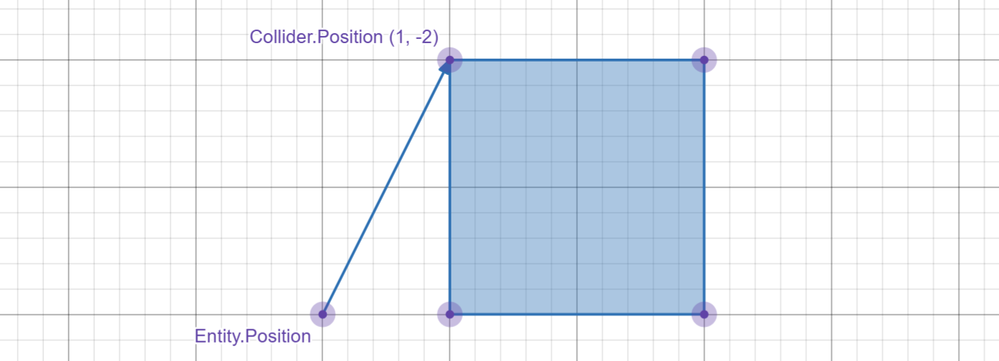

# 碰撞检测

碰撞检测是游戏逻辑的重要组成部分, 我们通过一个个不同的形状(矩形, 圆形)来表示一个对象的 "碰撞" 区域,
通过计算这些形状是否有重叠来判断两个对象之间是否 "碰到" 了.
所以像是玛德琳有没有撞到刺这种情况本质上就是判断玛德琳的碰撞箱是否跟刺的碰撞箱产生了重叠,

这一节会简单介绍一下蔚蓝的碰撞箱与使用.

## Collider

碰撞检测基于 `Entity` 的 `Collider? Collider` 属性. `Collider` 也就是碰撞箱, 用于定义实体的可碰撞区域, 默认是 `null`.      

`Collider` 的位置 `Position` 是相对于 `Entity.Position` 的, 默认是 `Vector2.Zero`.      
我们可以调整 `Collider.Position` 的位置给实体的碰撞箱加上偏移, 比如:

<del>(Desmos 神力</del>



这里给实体设置的是矩形碰撞箱 `Hitbox`, 我们给碰撞箱加上了 `(1, -2)` 的偏移.     

!!!info
    此外 `Collider` 也有 `Size`, `Center`,`Width`, `Height`等可能会用到的属性.

`Monocle` 内置了下面 4 种 `Collider`:

### Hitbox

`Hitbox` 是矩形碰撞箱, 也是最常用的碰撞箱. 玛德琳, 平刺, 以及常用的一种实体类型 `Solid` 的碰撞箱都是 `Hitbox`.

`Hitbox` 的构造函数是:

```cs
// 参数 width 与 height 是矩形碰撞箱的宽与长
// 参数 x 与 y 是矩形碰撞箱的位置, 也就是 Position.X 与 Position.Y 对应的值
// Position 对应矩形碰撞箱的左上角
public Hitbox(float width, float height, float x = 0f, float y = 0f)
```

下面是一个给实体加 `Hitbox` 的例子, 其他碰撞箱类型也是类似的:

```cs
[CustomEntity("MyCelesteMod/SampleEntity")]
public class SampleEntity : Entity
{
    public SampleEntity()
    {
        // 给实体设置长为 2, 宽为 2, 偏移为 (1, -2) 的 Hitbox
        // 也就是上面图中的例子
        Collider = new Hitbox(2f, 2f, 1f, -2f);
    }
}
```

!!!info
    碰撞箱的大小一般都是以 8 为倍数或 8 以上, <del>虽然你想设置多大都可以</del>.

### Circle

`Circle` 是圆形碰撞箱, 比如弹球, Badeline球的碰撞箱都是 `Circle`.

`Circle` 的构造函数是:

```cs
// 参数 radius 是圆形碰撞箱的半径
// 参数 x 与 y 是圆形碰撞箱的位置, 也就是 Position.X 与 Position.Y 对应的值
// Position 对应圆形碰撞箱的圆心
public Circle(float radius, float x = 0f, float y = 0f)
```

### Grid

`Grid` 是瓦片网格碰撞箱, 一般用于高效处理大量规则排列的瓦片碰撞, 比如常见的砖块 `SolidTiles` 就是以 `Grid` 作为碰撞箱的.

<del>偷个懒因为基本不会用到</del>

### ColliderList

`ColliderList` 用于组合多个碰撞箱, 让一个实体可以拥有复杂的碰撞区域.

`ColliderList` 的构造函数是:

```cs
// 参数 colliders 可以传入任意多的 Collider
public ColliderList(params Collider[] colliders)
```

一个例子是原版的圆刺 `CrystalStaticSpinner`:

```cs
public CrystalStaticSpinner(Vector2 position)
{
    // 设置圆刺的位置
    Position = position;

    // 组合两个不同的碰撞箱
    // CrystalStaticSpinner 的碰撞箱由 Circle 与 Hitbox 组成
    Collider = new ColliderList(new Circle(6f), new Hitbox(16f, 4f, -8f, -3f));
}
```

## 常用碰撞检测方法

设置好碰撞箱后, 我们就可以进行碰撞检测了.
比如检测玛德琳是否碰到刺, 实体是否碰到墙等. 都需要用到碰撞检测方法.

`Entity` 内自带了一些碰撞检测方法, 下面介绍一些常用的:

### CollideCheck

`CollideCheck` 用于检测不同实体之间是否发生碰撞, 签名是:

```cs
// 这个重载用于检测当前实体是否与其他实体 other 发生碰撞
public bool CollideCheck(Entity other)

// 这个重载用于检测当前实体是否与实体类型 T 发生碰撞
public bool CollideCheck<T>() where T : Entity
```

使用起来类似:

```cs
if (CollideCheck<Player>())
{
    // 碰到玛德琳了就做一些事
}
```

`Entity` 内有一个属性 `bool Collidable`, 用于表示该实体是否可碰撞.
设置为 `false` 的话所有关于该实体的碰撞检测都会返回 `false`, 也会让下面获取碰撞到实体的方法获取不到.

!!!info
    需要注意有部分实体的 `Collidable` 总是为 `false`, 比如 `SeekerBarrier`. 对它们进行碰撞检测通常需要把 `Collidable` 设为 `true`, 检测完成后再设为 `false`.

???info "Grid 与 Circle 的碰撞"
    需要注意一下 `Grid` 与 `Circle` 的碰撞检测总返回 `false`, <del>Monocle 这样写的.jpg</del>.      
    一定要进行检测的话可以通过钩取 `On.Monocle.Grid.Collide_Circle` 进行实现. 比如:

    ```cs title="MyEntity.cs"
    // 给 Module 调用的加载/卸载钩子的方法
    public static void Load() => On.Monocle.Grid.Collide_Circle += Grid_Collide_Circle;
    public static void UnLoad() => On.Monocle.Grid.Collide_Circle -= Grid_Collide_Circle;

    private static bool Grid_Collide_Circle(On.Monocle.Grid.orig_Collide_Circle orig, Grid self, Circle circle)
    {
        // 判断实体是不是自己的实体类型
        // 不是的话调用原方法
        if (circle.Entity is not MyEntity)
            return orig(self, circle);

        // 碰撞检测逻辑实现...
    }
    ```      

### CollideFirst

`CollideFirst` 用于获取第一个碰撞到的实体, 签名是:

```cs
// 获取当前实体第一个碰撞到的类型为 T 的实体
// 没有发生碰撞会返回 null
public T? CollideFirst<T>() where T : Entity
```

使用起来类似:

```cs
if (CollideFirst<CrystalStaticSpinner>() is CrystalStaticSpinner spinner)
{
    // 对第一个碰撞到的圆刺 spinner 做一些事
}
```

### CollideAll

`CollideAll` 用于获取碰撞到的所有特定类型的实体, 签名是:

```cs
// 获取当前实体碰撞到的所有类型为 T 的实体
// 没有发生碰撞 List 会为空
public List<Entity> CollideAll<T>() where T : Entity
```
使用起来类似:

```cs
// 显式指定 spinner 的类型
// 因为 CollideAll 返回的是基类 Entity
foreach(CrystalStaticSpinner spinner in CollideAll<CrystalStaticSpinner>())
{
    // 对所有碰撞到的圆刺 spinner 做一些事
}
```

### 位移检测

有时候我们希望检测的是实体加上一些位移量会不会发生碰撞, 比如玛德琳脚下是不是地面.       
上面介绍的方法都有一个设置碰撞箱偏移量进行碰撞检测的重载:

```cs
// 参数 at 用于指定碰撞检测是当前实体碰撞箱的偏移量
public bool CollideCheck(Entity other, Vector2 at)
public bool CollideCheck<T>(Vector2 at) where T : Entity
public T? CollideFirst<T>(Vector2 at) where T : Entity
public List<Entity> CollideAll<T>(Vector2 at) where T : Entity
```

比如:

```cs
if (CollideCheck<Player>(new Vector2(0f, -1f)))
{
    // 如果当前实体往上 1px 是玛德琳 做一些事
}
```
