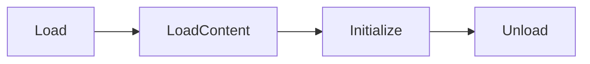

# EverestModule

## everest.yaml

`everest.yaml` 是 Mod 的配置文件，`Everest` 通过它来识别和加载你的 Mod.

对于 CodeMod 来说 `everest.yaml` 通常是这样的:

```yaml title="everest.yaml"
- Name: MyCelesteMod
  Version: 0.1.0
  DLL: MyCelesteMod.dll
  Dependencies:
    - Name: EverestCore
      Version: 1.5577.0
```

* `Name`: 这是我们 Mod 的唯一标识符, `Name` 相同的不同 Mod 会被 `Everest` 认为是同一个 Mod, 所以请保证 `Name` 是唯一的. 
* `Version`: 这是我们 Mod 的版本号, 格式为 `x.y.z`.     
* `DLL`: 这是我们 Mod 的程序集路径, 对于 CodeMod 是必需的.
* `Dependencies`: 这是我们 Mod 所依赖的其他 Mod 列表, 里面填写的是其他 Mod 的 `everest.yaml` 中的元数据, 即 `Name` 与 `Version`.     

通常对于 CodeMod 来说只依赖版本为 `1.5577.0` 的 `EverestCore` 就可以.     
想使用新版本 `Everest` 所提供的功能需要手动指定 `EverestCore` 的版本, 可以在[这里](https://github.com/EverestAPI/Everest/releases){:target="_blank"}进行查阅.

## EverestModule

`EverestModule` 是我们 Mod 的核心, 就像 `C#` 应用程序有 `Main()` 方法一样,
`EverestModule` 就相当于我们 Mod 的 `Main()` 方法.          
每个 Mod 都需要一个继承自 `EverestModule` 的类作为入口点, `Everest` 会在游戏启动时自动加载它.

一个最简单的 `EverestModule` 看起来是这样的:

```cs title="MyCelesteModModule.cs"
namespace MyCelesteMod;

public class MyCelesteModModule : EverestModule
{
    public override void Load()
    {
    }

    public override void Unload()
    {
    }
}
```

需要注意的是 `EverestModule` 是抽象的, 它要求我们实现 `Load()` 与 `Unload()` 两个方法.

### 生命周期

`EverestModule` 的生命周期是:



我们可以重写这些生命周期方法:

* `Load()`: 会在我们的 Mod 被 `Everest` 加载时调用, 可以在这里做一些初始化工作, 比如注册钩子等.                
* `LoadContent(bool firstLoad)`: 会在蔚蓝加载资源时调用, 可以在这里加载我们需要的资源, 比如自定义 `SpriteBank`.    
* `Initialize()`: 会在所有启用的 Mod 加载完成后, 蔚蓝的游戏窗口出现时调用, 可以在这里做一些需要全部 Mod 加载完成后的操作.        
* `Unload()`: 会在我们的 Mod 被 `Everest` 卸载时调用, 可以在这里释放我们的资源, 比如钩子等.

!!!info
    热重载时 `Everest` 会先调用 `Unload` 卸载我们的 Mod, 然后依次调用 `Load`, `LoadContent`, `Initialize` 重新加载我们的 Mod.           
    所以在 `Unload` 中释放我们的资源是必需的, 否则可能导致内存泄露.

!!!info
    此外 `LoadContent(bool firstLoad)` 的参数 `firstLoad` 在热重载时总为 `false`, 只有在第一次加载, 也就是蔚蓝启动时为 `true`.

## 依赖管理

`everest.yaml` 中的依赖分为以下两种:

- `Dependencies` 必需依赖: 会在你的 Mod 加载前完成加载.
- `OptionalDependencies` 可选依赖: 只有在被启用时加载, 未启用则会忽略.

!!!info
    `Version` 格式为 `x.y.z`, 从左到右依次比较.    
    `Everest` 会加载版本号大于等于指定版本的依赖 Mod.

    必需依赖未满足时, Mod 会加载失败.   
    可选依赖未满足时, Mod 还是可以正常加载.

我们通常会在需要[与其他 CodeMod 交互](../../advanced/cross_mod_interaction.md)时声明可选依赖, 比如:

```yaml title="everest.yaml"
- Name: MyCelesteMod
  Version: 0.1.0
  DLL: MyCelesteMod.dll
  Dependencies:
    - Name: EverestCore
      Version: 1.5577.0
  OptionalDependencies:
    - Name: GravityHelper
      Version: 1.2.20
```

这里我们声明了版本为 `1.2.20` 的 `GravityHelper` 作为可选依赖, 我们需要手动检查可选依赖是否成功加载:

```cs title="MyCelesteModModule.cs"
public static bool GravityHelperLoaded {get; private set;}

public override void Initialize()
{
    // 创建 GravityHelper 的元数据用于检查
    EverestModuleMetadata gravityHelperMetadata = new()
    {
        Name = "GravityHelper",
        Version = new Version(1, 2, 20)
    };
    
    // 判断 GravityHelper 是否成功加载
    GravityHelperLoaded = Everest.Loader.DependencyLoaded(gravityHelperMetadata);
}
```

!!!info
    这里建议在 `Initialize()` 而不是 `Load()` 中检查可选依赖. 因为在 `Load()` 时其他 Mod 可能还未加载完成.          
    `Load()` 与 `Initialize()` 类似于 `Entity` 的 `Added()` 与 `Awake()` 的区别.

完成后我们就可以判断这个属性决定是否开启一些功能等:

```cs
if (MyCelesteModModule.GravityHelperLoaded)
{
    // 做一些事...
}
```