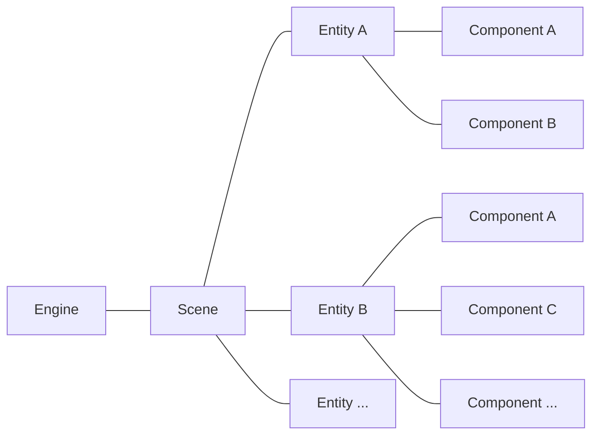

# EC 架构

!!!info
    这一篇主要介绍概念, 游戏主循环与生命周期可以在[这里](life_cycle.md)阅读.

`Monocle` 引擎基于 `EC (Entity-Component)` 架构, 它是游戏的一种组织方式的实现.
`Monocle` 引擎主要由下面几个部分组成:

* `Engine`: 游戏的核心.
* `Scene`: 场景, 所有的实体, 即 `Entity` 都存在于场景中.
* `Entity`: 实体, 由 `Scene` 管理并具有生命周期的对象.
* `Component`: 组件, 为实体提供可复用的通用功能模块.

通常来说一个正在运行的 `Monocle` 游戏的结构就像:

简单来说, 就像搭积木一样. 场景 `Scene` 是底板, 实体 `Entity` 是搭在底板上的积木块, 而组件 `Component` 是给积木块添加的各种零件. 比如轮子让它能动, 灯让它能发光, 贴纸让它有图案. 尽管你可以写代码让实体长出轮子, 但肯定不如可拆卸的轮子方便和灵活.

## Engine

`Engine` 是整个游戏的核心, 负责管理场景与游戏主循环.            
通常我们并不需要直接操作 `Engine`, 大部分操作都可以在 `EC` 层完成.

不过 `Engine` 有一些属性我们可能会访问:

* `Engine.DeltaTime`: 上一帧到这一帧的时间间隔, 单位是秒, 通常约为 `1/60`.
* `Engine.TimeRate`: 引擎的时间流速倍率, 默认为 `1.0`.
* `Engine.Scene`: 当前正在运行的场景.

## Scene

`Scene` 是游戏的场景, 同一时间只有一个 `Scene` 运行. 游戏中的主界面, 关卡, Pico8 等都是不同的场景.          
通常我们也不需要直接操作 `Scene` <del>(草</del>. 

`Scene` 的一些属性与方法我们在开发时会经常使用:

* `Entities`: 被添加到场景的实体列表.
* `Paused`: 是否暂停, 暂停时不会执行实体的更新方法 `Update()`.
* `TimeActive`: 场景开始后经过的时间, 单位是秒.
* `Tracker`: 快速查找场景中的实体与组件, 具体可以在[这里](../application/tracker.md)阅读.
* `Add(Entity entity)`: 向场景中添加实体 `entity`.
* `Remove(Entity entity)`: 移除场景中的实体 `entity`.
* `OnInterval(float interval)`: 每隔指定时间 `interval` 返回一次 `true`, 用于定时执行逻辑.

## Entity

`Entity` 是我们大部分时候打交道的对象, 玛德琳, 刺, 草莓等等都是不同的实体.

`Entity` 的一些属性与方法我们在开发时会经常使用:

* `Scene`: 实体所属的场景.
* `Components` 实体被附加的组件列表.
* `Position`: 实体在场景中的位置坐标.
* `Tag`: 实体所拥有的标签.
* `Active`: 是否激活, 不激活时不会执行实体的更新方法 `Update()`.
* `Visible`: 是否可见, 不可见时不会执行实体的渲染方法 `Render()`.
* `Collidable` 是否可碰撞, 不可碰撞时所有关于该实体的碰撞检测都会返回 `false`.
* `Add(Component component)`: 向实体添加组件 `component`.
* `Remove(Component component)`: 移除实体的组件 `component`.
* `RemoveSelf()`: 从所属场景中移除自身.
* `SceneAs<T>()`: 将所属场景转换为类型 `T` 返回.

## Component

`Component` 是可以附加于实体的可复用功能模块, `Sprite`, `Tween`, `Coroutine`等都是不同的组件.

`Component` 的一些属性与方法我们在开发时会经常使用:

* `Scene`: 组件所属的实体的所属场景.
* `Entity`: 组件所属的实体.
* `Active`: 是否激活, 不激活时不会执行组件的更新方法 `Update()`.
* `Visible`: 是否可见, 不可见时不会执行组件的渲染方法 `Render()`.
* `RemoveSelf()`: 从所属实体中移除自身.
* `SceneAs<T>()`: 将所属场景转换为类型 `T` 返回.
* `EntityAs<T>()`: 将所属实体转换为类型 `T` 返回.