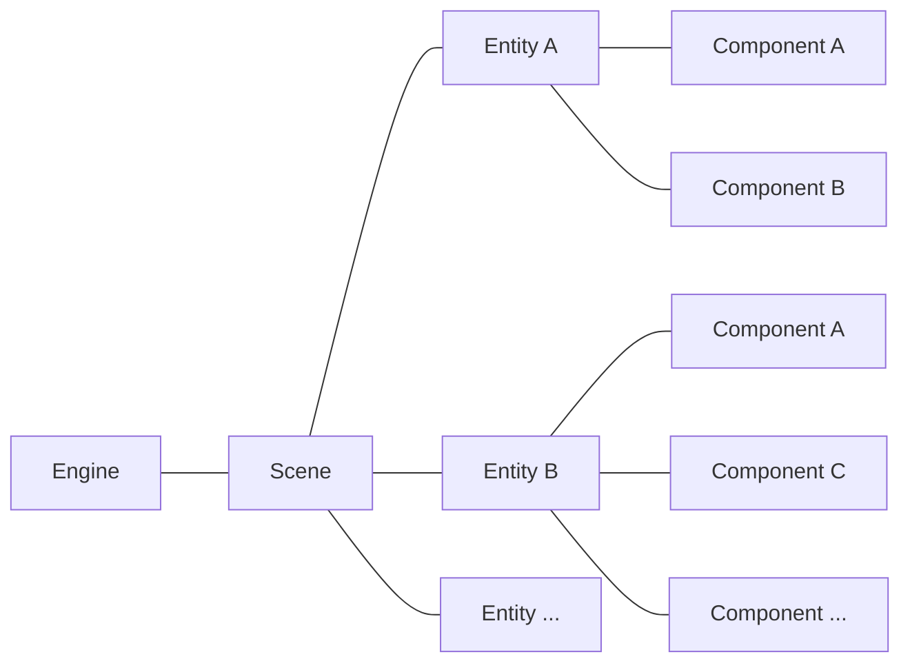

# EC 架构

在这里我会简单介绍一下整个蔚蓝是怎么组织起来的.  
首先蔚蓝基于 `Monocle` 引擎, 这是 `matt` 自己开发的一个引擎, 所以别指望你能在网上找到它的教程(,
其次 `Monocle` 依赖于 `XNA` (已停止维护) 或者 `FNA` (`XNA` 框架的重新实现),
而`XNA` 提供的 api 都非常原始, 甚至连最基本的场景组织之类的都没有, 所以 `Monocle` 就是来实现这些的.  

通常来说一个正在运行的 `Monocle` 游戏的结构就像:

- `Scene` 表示一个场景, 比如主界面场景, pico8 场景, 以及最常见的 gameplay 场景.  
- `Entity` 表示一个实体, 比如说玛德琳就是一个实体, 一个弹球是一个实体, 一个泡泡是一个实体.
- `Component` 表示一个组件, 它附加与实体之上, 通常我们能直接看到的只有图片组件, 比如岩浆块的贴图就是由 `Image` 组件来展现的, 玩家的动画由 `Sprite` 组件展现.  

!!! info
    以上这个架构我们就称为 `EC` 架构, 它是游戏的一种组织方式的实现.  

通常地, 每过 `1/60` 秒, `Engine` 就会被调用它的 `Update()` 函数用来更新游戏逻辑,
`Engine.Update()` 内部会再次调用 `Scene` 的 `Update()` 函数,
`Scene.Update()` 内部会遍历它所有的 `Entity` 并调用它们的 `Update()` 函数,
`Entity.Update()` 内部还会遍历它所有的 `Component` 并调用它们的 `Update()` 函数.  

那么自然, `Player.Update()` 就是玛德琳每帧的更新逻辑所在的地方了. 现在我们做一个小 demo, 将玩家的冲刺数量锁死为单冲.  

## Entity

`Entity` 本身有四个公开的字段:

- `Active`, 该 `bool` 字段表示该 `Entity` 是否 "存活", 否则为 "失活", "失活" 的 `Entity` 将不会被调用 `Update` 方法直到 `Active` 为 `true`
- `Collidable`, 该 `bool` 字段表示该 `Entity` 是否 "可碰撞", 不可碰撞的实体与任何实体进行碰撞检测时都会返回 `false`, 所以你可以将它设为`false`来禁用它的碰撞箱
- `Visible`, 该 `bool` 字段表示该 `Entity` 是否 "可见", 不可见的实体不会被调用 `Render` 方法, 注意即使不可见它的碰撞箱依然存在.
- `Position`, 该 `Vector2` 字段表示该 `Entity` 的位置, 注意这个位置相对的坐标系是不同的, 对于 HUD 实体来说它的坐标系是一个 1922 x 1092 的原点左上角的屏幕坐标, 对于 gameplay 实体来说它是相对于世界原点的分度值为 1px 的坐标. 这个行为可以通过后面所说的 `Tag` 来配置.

## Component

## Scene