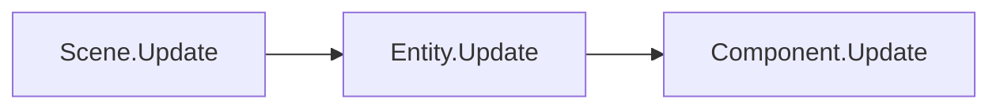
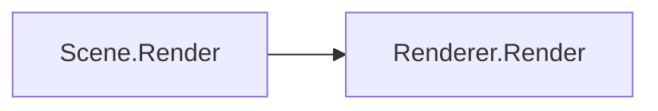
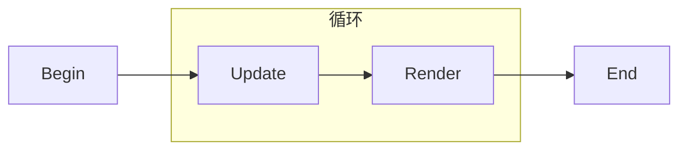
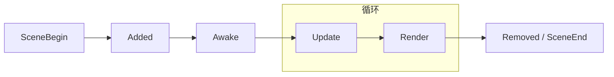
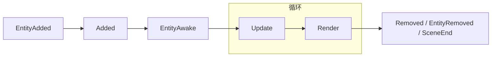

# 生命周期

## 游戏主循环

`Monocle` 引擎每帧都会依次执行当前 `Scene` 的 `Update()` 与 `Render()`:

* `Update()`: 游戏的逻辑更新, 比如玛德琳的移动, 开望远镜, <del>撞刺上爆炸</del>等.
* `Render()`: 游戏的渲染, 即把画面显示出来. 比如各种背景, 动画等.

这个循环会一直重复执行, 直到退出游戏.

!!! info
    游戏中的冻结帧就会临时不执行关卡的 `Update()` 只进行 `Render()`, 使得游戏看上去被 "冻结了".  
    此外游戏中的冲刺方向辅助也会不执行 `Update()`, 这部分逻辑甚至是在 `Monocle` 的层级上做的<del>(或许算个屎山代码)</del>

### 调用层级

`Scene` 的 `Update()` 和 `Render()` 的调用方式不同:

* `Update()`: 直接调用场景中所有实体的 `Update()`, 实体再调用其组件的 `Update()`.
* `Render()`: 调用场景中所有 `Renderer` 的 `Render()`, 由  `Renderer` 决定如何渲染.

对于 `Update()` 方法, 调用层级看起来是:



!!! info
    这里其实省略了一层, 实际上实体与组件的 `Update()` 是由 `Scene.Entities.Update()` 与 `Entity.Components.Update()` 调用的.            
    `Entities` 与 `Components` 的类型分别是 `EntityList` 与 `ComponentList`. 两者都是 `Monocle` 提供的管理实体/组件的类.   

    后面渲染相关调用 `Renderer.Render()` 的是 `Scene.Renderers`, 类型是 `RendererList`, 也是类似的管理渲染器的类.

对于 `Render()` 方法会稍微复杂一些, 调用层级看起来是:



`Renderer` 是渲染器, 负责特定目标的渲染. `Scene` 可以有任意多的渲染器.       

以我们最常接触的场景 `Level`, 也就是关卡为例. `Level` 中有这些渲染器:

```cs
// 背景渲染器, 渲染关卡的背景, 比如 9a 的黑洞等.
public BackdropRenderer Background;
public BackdropRenderer Foreground;

// 游戏内容渲染器, 渲染关卡中的所有实体, 比如玛德琳, 刺等.
// 我们编写的实体与组件的渲染都是由这个渲染器负责.
public GameplayRenderer GameplayRenderer;

// Hud 渲染器, 渲染 UI 相关, 比如暂停界面, 速通计时器等.
public HudRenderer HudRenderer;

// 一些相关特效的渲染器, 比如泛光, 8a 的热变形, 5a 结尾的冲击波等.
public LightingRenderer Lighting;
public DisplacementRenderer Displacement;
public BloomRenderer Bloom;
```

对于逻辑的更新我们应在 `Update` 中做, 而有关渲染的任务我们应该在 `Render` 中做, 这是因为即使你在 `Update` 中进行了渲染的调用,
在 `Render` 开始之前也会被蔚蓝清空. 类似地, 游戏中的暂停的实现原理是停止每帧 `Update` 的调用而保留 `Render` 的调用,
那么自然如果你在 `Render` 里进行逻辑更新你会破坏掉游戏原有的暂停.  

## 生命周期

`Scene`, `Entity`, `Component` 都有各自的生命周期与生命周期方法, 下面会简单介绍.

### Scene

`Scene` 的生命周期看起来是:



!!!info
    这里实际上省略了一些, `Update()` 与 `Render()` 调用前后都有对应的 `BeforeUpdate/Render()` 与 `AfterUpdate/Render()` 方法.       
    实体的添加/移除是在 `BeforeUpdate()` 中进行的, 所以实际上向场景添加/移除实体到下一帧才会发生.

!!!info 
    此外 `Everest` 为 `Scene` 添加了一个 `Action OnEndOfFrame` 的事件, 这个事件会在 `Scene.AfterUpdate()` 中调用,
    即所有实体更新完成后调用.           
    有需要时可以订阅这个事件做一些跨帧的工作.

场景开始时, `Engine` 会调用 `Scene.Begin()`, 然后场景每帧会依次调用 `Update()` 与 `Render()`, 直到场景结束.         
场景结束时 `Engine` 会调用 `Scene.End()`, 然后调用新场景的 `Scene.Begin()`, 这样就完成了一次场景的切换.

### Entity

`Entity` 的生命周期看起来是:



实体所属场景的 `Scene.Begin()` 会同步调用所有实体的 `SceneBegin(Scene scene)` 方法.         
当实体被 `Scene.Add(Entity entity)` 方法添加到场景时会调用 `Added(Scene scene)` 方法, 可以在这里做一些准备工作.         
当全部同类实体被添加到场景后会调用 `Awake(Scene scene)` 方法, 可以在这里做一些需要全部同类实体都完成添加后的操作.           
一个很好的例子是浮动块 `FloatySpaceBlock` 的连接, 这是在 `Awake` 中做的, 为了防止遗漏某些浮动块间的连接就需要在实体都被加入后再连接.

实体被添加到场景后会被依次调用 `Update()` 与 `Render()`, 直到被移除出场景或场景结束.

当实体被 `Scene.Remove(Entity entity)` 方法移除出场景时会调用 `Removed(Scene scene)`, 可以在这里做一些清理工作.     
实体所属场景的 `Scene.End()` 会同步调用所有实体的 `SceneEnd(Scene scene)` 方法.  

!!! info
    实体被 `Scene.Remove` 移除出场景后不会调用 `SceneEnd` 方法, 因为场景结束时实体已经不在场景中了.     
    实体所属场景结束时只会调用 `SceneEnd` 方法, 并不会把实体从场景中移除, 所以一般清理相关的代码会在 `Removed` 与 `SceneEnd` 中都写一份.  
    此外要注意的是 `Scene.Remove` 调用后只是把实体加入 "移除队列", 下一帧开始时才会进行实际的移除任务.
    下述的组件则是在所有组件完成更新后执行.

### Component

`Component` 的生命周期与 `Entity` 类似, 看起来是:



组件所属实体的 `Entity.Added()` 会同步调用所有组件的 `EntityAdded(Scene scene)` 方法.         
当组件被 `Entity.Add(Component component)` 方法添加到实体时会调用 `Added(Entity entity)` 方法.         
组件所属实体的 `Entity.Awake()` 会同步调用所有组件的 `EntityAwake(Scene scene)` 方法.

组件被添加到实体后会被依次调用 `Update()` 与 `Render()`, 直到被移除出实体, 或实体被移除出场景, 或场景结束.

当组件被 `Entity.Remove(Component component)` 方法移除出实体时会调用 `Removed(Entity entity)`.          
组件所属实体的 `Entity.Removed()` 会同步调用所有组件的 `EntityRemoved(Scene scene)` 方法.     
组件所属场景的 `Scene.End()` 会同步调用所有组件的 `SceneEnd(Scene scene)` 方法.
!!!info
    需要注意的是组件的生命周期方法都是在 `Entity` 基类中调用的.         
    在编写实体并重写生命周期方法时记得调用 `base.XXX()`, 否则组件的生命周期方法不会被调用.

    一般来说 `base.XXX()` 写在开始就可以, 不过有些情况会希望更改 `base.XXX()` 的调用时机.
