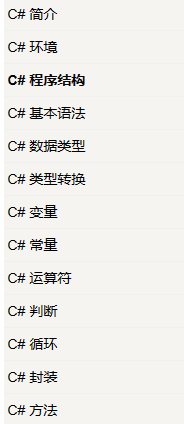
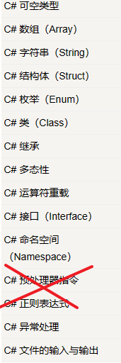
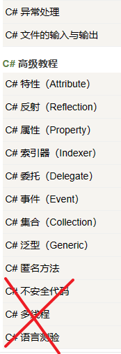
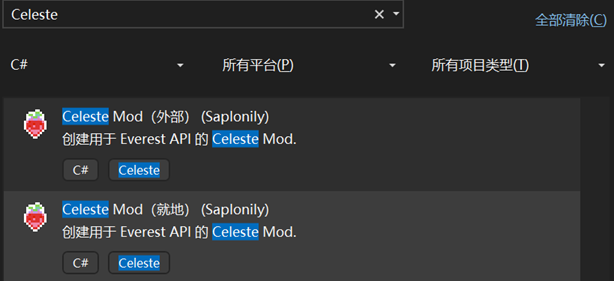
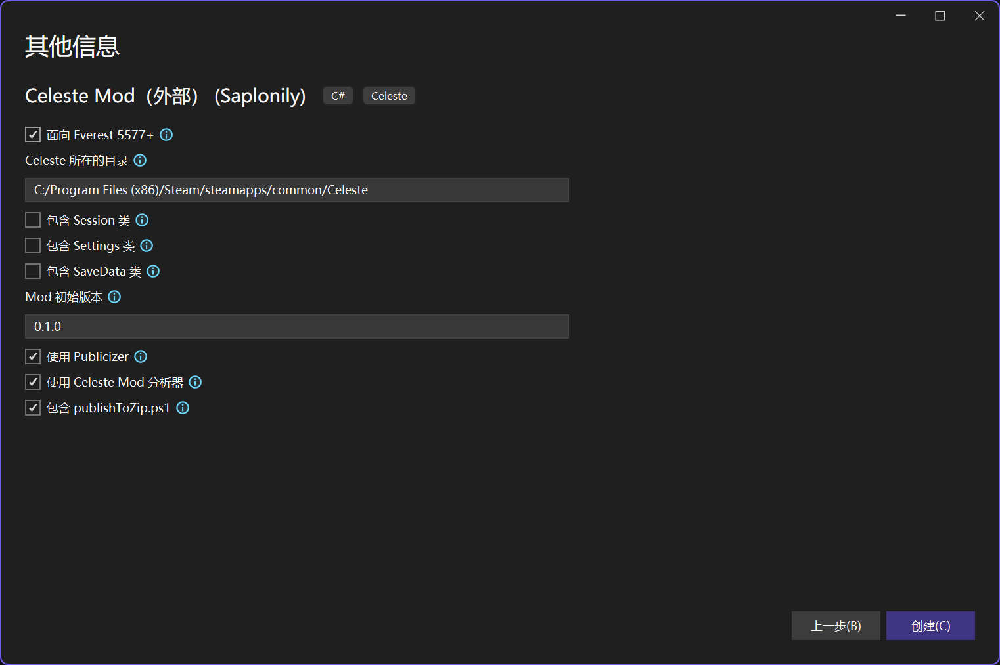
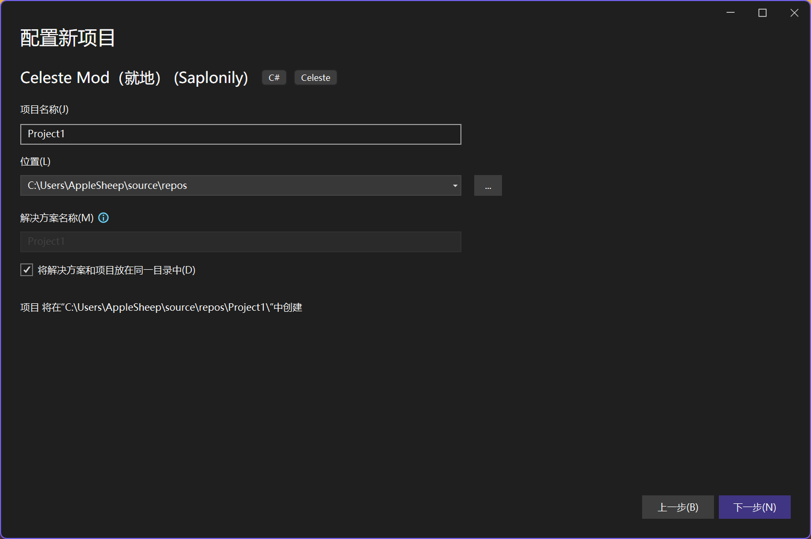

# 基础环境配置

!!! note
    本节内容由手动配置重写为通过模板配置, 旧版你可以到[归档-基础环境配置](../arc/basic_env.md)中找到(不推荐)

## Celeste

!!! note
    如果你不是 Windows 用户的话这一步你可以直接跳过.

!!! info
    在 [Everest Core](../extra/faq.md#net-core-everest) 版本后(Stable 版本号大于 4465)强制切换为了 FNA 版本, 如果你已是 Core 版本你可以跳过这一步.

Everest 需求我们使用 FNA 版本的蔚蓝, 而 Linux 和 MacOS 上的蔚蓝已经就是 FNA 版本了, 而在 Windows 上则是 XNA 版本, 所以我们需要一些方法切换到 FNA 版本:

- 在 Steam 上:  库->Celeste, 右键菜单属性->测试版->Opengl
- 在 itch 上: 重新下载一个 `Celeste Windows OpenGL` 版本
- 在 Epic 上: 已经是 FNA 版本了

!!! note
    Everest 会在运行时将你以 FNA 版本制作的 mod 重链接为 XNA, 所以你不是很需要在意这俩的差距  
    注意更换版本后会变回原版, 你需要重新安装 Everest

## C# 编程能力 与 开发环境

因为我们是 Code Mod, 嗯, 那么写一些代码是必不可少的, 蔚蓝是使用 `C#` 基于 `.NET Framework 4.5.2` 来制作的, 那么学习 `C#` 当然是必不可少的.  
!!! info
    在 Everest Core 版本上蔚蓝被迁移到了 `.NET 7` 上, 不过基于旧框架的 mod 会尽可能地被 Everest 自动转换为基于新框架的 mod.
!!! info
    理论上所有 **.NET 系**语言比如 `VB.NET` `F#` 都可以, 不过为了方便起见我们还是使用 C#.

好吧这句话可能说的太平淡了(, 毕竟大部分<del>蔚批</del>蔚蓝 mod 爱好者就是被这一步卡住的, 那么这里...只能给你推荐几个学习渠道了,
毕竟在这里没必要让这个教程过于全能.

1. 视频: [Bilibili - 丑萌气质狗 - 【C#零基础入门教程 Visual Studio 2022】人生低谷来学C#](https://www.bilibili.com/video/av895726228) (全p, 稍微不全)
2. 视频: [Bilibili - C#从入门到精通（第5版）](https://www.bilibili.com/video/av882929680) (1-71p, 109-132p)
3. 视频: [Bilibili - 刘铁猛 - C#语言入门详解-第1季-剪辑版-全33课-分154集](https://www.bilibili.com/video/av906241776) (1-152p)
4. 网站: [Runnob - C# 教程](https://www.runoob.com/csharp/csharp-tutorial.html)
5. 网站: [w3schools - C# 教程](https://www.w3schools.com/cs/index.php) (英文)
6. 书籍: C#入门经典-第7版-C# 6.0

!!! info
    如果你没有能力支持正版书籍的话, 你可以到一些 C# 开发者群内寻找它的电子非正版(比如视频 `1.` up 的群内)  
    上面几个我更加推荐的是 `1.` 和 `3.`  
    借用 `4.` 的目录, 确保你对下面这些概念(画 × 的暂时在蔚蓝 Code Mod 中用不到)有足够清晰的了解在开始你的蔚蓝 Code Mod 之旅之前:  
    
    
    

相信在上面的教程中你应该已经被推荐了一些编辑器 / IDE, 那么在本教程中我个人会为了方便**仅**在 `Windows` 上使用 `Visual Studio`, 当然不保证在其他地方会遇到奇奇怪怪的问题. \_(:з」∠)\_

## 通过模板创建项目

!!! info
    在蔚蓝国外社区流行着另一个 mod 项目模板, [这是它的 Github 主页](https://github.com/EverestAPI/CelesteModTemplate)
    不过这里主要介绍使用我个人制作也是个人最常用的一个.

!!! note
    项目模板在重构的教程中进行了更新, 旧版你可以在[归档-通过模板创建项目](../arc/project_template.md)中找到(不推荐)

我们在这里提供两种模板:

- 外部: 在蔚蓝根目录外编写代码.
- 就地: 在 `Celeste/Mods/<你的 Mod 名称>/Source` 中编写代码.

我们在下面会使用 `Visual Studio` 进行演示.
或者你也可以选择使用 `dotnet cli` 从 nuget 上的模板安装:

!!! note
    你可能还需要安装 `.NET 8 SDK` 来使用该模板, 你可以[在这里](https://get.dot.net)找到它

??? info "使用 dotnet cli 从模板新建项目"
    首先在一个你喜欢的位置放置你的项目文件夹, 名字即为你的项目名, 例如 `MyCelesteMod`:
    ```bat
    mkdir MyCelesteMod
    cd MyCelesteMod
    ```
    然后在此位置安装 nuget 上我的 mod 模板(如果你没有安装的话):
    ```bat
    dotnet new install Saladim.CelesteModTemplate
    ```
    然后你就能使用这条指令直接创建外部模板了:
    ```bat
    dotnet new sapcelestemode
    ```
    如果需要就地模板使用这条指令:
    ```bat
    dotnet new sapcelestemodi
    ```
    下面是可选择的一些参数:

    - `-n`: 你的 Mod 名称, 默认为 `MyCelesteMod`, 用于重写项目名字, 例如 `-n YourCelesteMod`.
    - `-c`: 指定蔚蓝根目录(只对外部模板生效), 例如 `-c "C:\Program Files\steam\steamapps\Celeste"`.
    - `-up`: 是否使用 Publicize 后的 Celeste 程序集, 默认开启, 关闭可以 `-up false`.
    - `-ua`: 是否使用 Celeste Mod 分析器, 默认开启, 关闭可以 `-ua false`.
    - `-ss`: 向项目中添加 `Session` 类并在 `Module` 中自动配置, 默认关闭.
    - `-st`: 向项目中添加 `Settings` 类并在 `Module` 中自动配置, 默认关闭.
    - `-sd`: 向项目中添加 `SaveData` 类并在 `Module` 中自动配置, 默认关闭.
    - `-ev`: 指定 `everest.yaml` 中的 `EverestCore` 版本, 默认为 `4465`.
    - `-mv`: 指定 `everest.yaml` 中的你的 Mod 的初始版本, 默认为 `0.1.0`.

首先我们打开命令行, 输入以下命令进行安装:
```bat
dotnet new install Saladim.CelesteModTemplate
```

完成后打开 `Visual Studio`, 选择 `创建新项目`, 然后在搜索框中输入 `Celeste`, 你应该能看到以下两个模板:


### 外部模板

选择并填写好项目名称之后, 你应该能看到以下内容:


其中的各选项详细信息可以把鼠标移到旁边的 `info` 图标进行查看.

完成创建后你可以按下 `Ctrl+B` 或者手动点击 `生成->生成解决方案`,
如果你在你的 vs 输出里面看到了类似这两句:

```
1>MyCelesteMod -> D:\User\temp\cm\bin\x86\Debug\net452\MyCelesteMod.dll
1>MyCelesteMod -> C:/Program Files (x86)/Steam/steamapps/common/Celeste/Mods/MyCelesteMod_copy/MyCelesteMod.dll
```

并且你在你的蔚蓝 Mod 目录下找到了这个被创建的目录,
那么你的环境就算是配完了, 如果你很感兴趣这之中发生了什么, 要引用哪些程序集, 这个模板背后干了什么, 你可以去看那复杂的旧的配置方法.
!!! note
    这个模板使用 `msbuild` 帮助了你很多事!  
    比如当你编译完项目之后它会复制编译结果到项目目录的 `ModFolder` 目录下,
    然后将整个 `ModFolder` 复制到蔚蓝的 `Mods\{你的mod名}_copy` 文件夹下!
    所以当我们需要更改一些比如说 loenn 的配置文件, `everest.yaml` 的内容, 你的测试地图等时, 
    你只需要简单地重新编译一遍项目, 然后等待模板来帮你做剩下的活!  

### 就地模板

就地模板在进行项目名称填写时你应该会看到以下内容:


这里的 `项目名称` 就是你的 Mod 名称.    
`位置` 我们需要改到蔚蓝的 `Mods` 目录下, 例如 `C:\Program Files\steam\steamapps\Celeste\Mods`.     
填写完成后我们还需要勾选 `将解决方案和项目放在同一目录中`.

后面的项目配置基本与外部模板一致, 除了 `Celeste 所在的目录`. 这项已经在上一步的 `位置` 填写过了所以不需要再填写.

!!!info
    模板创建完成后 `Visual Studio` 会自动打开我们 CodeMod 的 `Module.cs`, 感兴趣可以在这里[了解](../basics/everest_module.md).


这一节完成后你的目录结构大概会像是          
外部模板:

- 📁 MyCelesteMod (你项目的根目录)
    - 📁 ModFolder
        - 📁 Code
            - ⚙️ MyCelesteMod.dll
            - ⚙️ MyCelesteMod.pdb
        - 📄 everest.yaml
    - 📄 CelesteMod.props
    - 📄 CelesteMod.targets
    - 📄 MyCelesteMod.csproj
    - 📄 MyCelesteModModule.cs

或 就地模板:

- 📁 MyCelesteMod (你项目的根目录)
    - 📄 everest.yaml
    - 📁 Source
        - 📄 CelesteMod.props
        - 📄 CelesteMod.targets
        - 📄 MyCelesteMod.csproj
        - 📄 MyCelesteModModule.cs
        - 📄 .everestignore
    - 📁 Code 
        - ⚙️ MyCelesteMod.dll
        - ⚙️ MyCelesteMod.pdb

其中正如之前所介绍的, 如果你使用外部模板的话, mod 的资源文件应该放在 `ModFolder` 中, 然后就像往常一样放置你的 mod 资源, 当你的项目在构建时它们会自动被复制.
并且将代码文件放置在 `.csproj` 同目录下或嵌套文件夹下,
如果你没有更改你的项目而只更改了资源文件时你会发现编译项目会因为 "所有文件都是最新的" 而跳过编译, 而同时也会跳过我们的资源复制, 对此我们有两种解决方案:

- 直接强制重新构建项目 (vs 中 "生成" -> "重新生成项目")
- 在项目根目录执行 `msbuild -target:PostModBuild` 命令行

> 好像是有更好的解决方法, 不过鉴于本人 MSBuild 知识不足只能做成这样了(x
