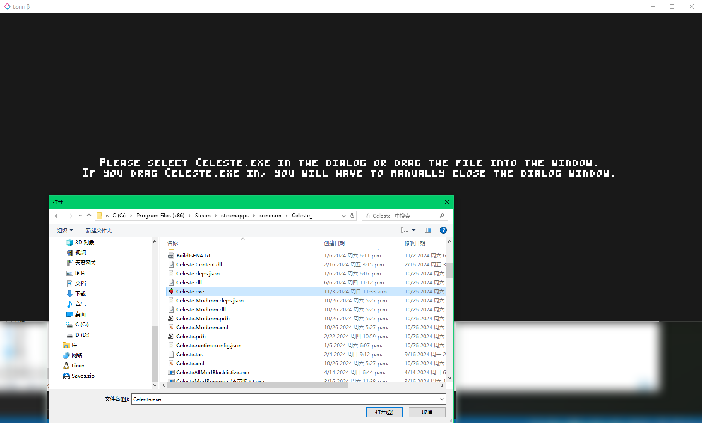
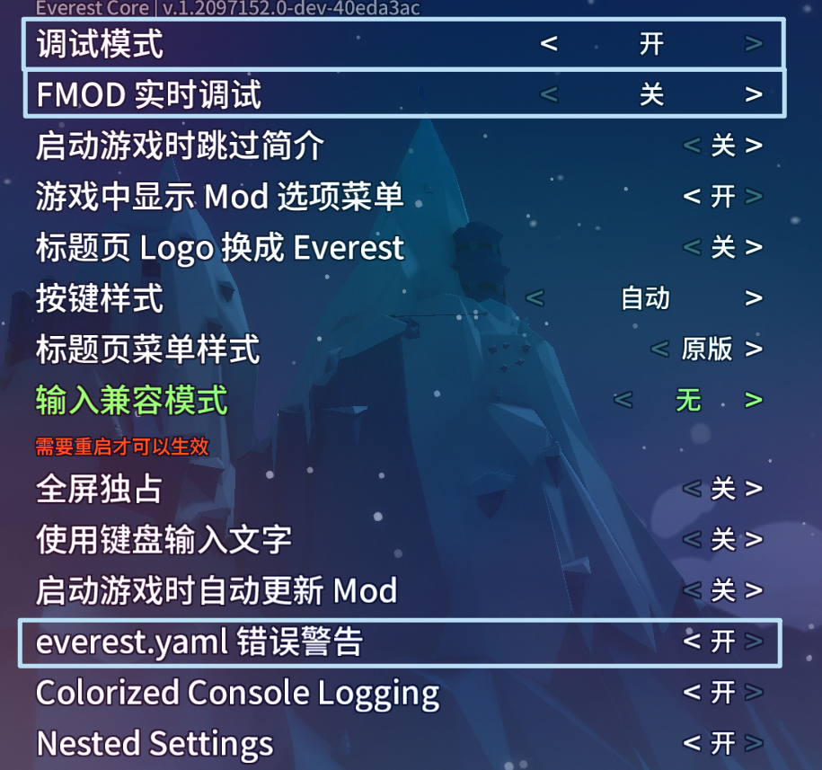

# 安装 Loenn

## 介绍

Lönn（或者写作 Loenn） 是目前主要的蔚蓝制图软件，它是一个几年前主要的制图软件 Ahorn 的替代，不过目前 Ahorn 已停止更新，所以我们只需要关注 Loenn。  
Loenn 开源在 [GitHub](https://github.com/CelestialCartographers/Loenn) 上，所以你可以选择前往 [GitHub Releases](https://github.com/CelestialCartographers/Loenn/releases) ~~忍受极慢的速度~~&#8203;下载，或者，前往制图群的群文件中下载，它位于 “制图工具 本体(Loenn及Ahorn)” 文件夹中。
<!-- 删除线左右都要加空格或者不加, 这里似乎只能这么解决了...? -->
-----

Loenn 支持三大桌面系统，所以一般你下载它时会遇到三种后缀的压缩包：

- `Loenn-v1.0.3-windows.zip`
- `Loenn-v1.0.3-macos.app.zip`
- `Loenn-v1.0.3-linux.zip`

一般大概率你都在 `Windows` 平台上，此时你需要下载 `windows` 结尾的压缩包。  
下载完毕后，解压压缩包，然后将整个文件夹放到一个你能找到的地方，然后双击 `Lönn.exe` 就能打开 Loenn 了。此时你应该能看到它默认打开了 7a：

## 可能遇到的问题

### 未找到蔚蓝

> PLEASE SELECT CELESTE.EXE IN THE DIALOG OR DRAG THE FILE INTO THE WINDOW.
> IF YOU DRAG CELESTE.EXE IN, YOU WILL HAVE TO MANUALLY CLOSE THE DIALOG WINDOW.

该消息表示 Loenn 并没有在默认的一些位置（例如 Steam 游戏目录中）找到蔚蓝，此时你需要在弹出的对话框中选择蔚蓝的 `Celeste.exe` 文件，或者将该文件拖入窗口中(然后手动关掉对话框)。

### 路径包含中文字符

> utils/filesystem.lua:40: Invalid value (nil) at index 1 in table for 'concat'

该消息表示很可能你的 Windows 用户文件夹名包含了中文，目前 Loenn 对中文路径会报错，但是更改 Windows 用户文件夹名风险很高，Loenn 提供了另外一种解决方法：

- 首先为你的 `Lönn.exe` 新建一个快捷方式
- 右键快捷方式选择属性，然后在弹出的窗口中转到 `快捷方式` 页面在 `目标` 的输入框后面加上 ` --portable`（注意最前面有空格并且有两个 `-` 符号）

此后你就可以用这个快捷方式正常启动 Loenn 了，
这会让 Loenn 的配置文件都放置在当前目录下而不会尝试放在用户文件夹下，避免了 Loenn 的报错。

# 游戏侧的配置

在安装好 `Everest` 后，你需要转到 `Mod 选项` 并打开如下几项设置：

- 调试模式：允许你按下 `F6` 打开调试地图，并随意地传送到任何一个房间，还有很多其他的便于制作 Mod 的功能。
- FMOD 实时调试：允许你调试游戏内播放的音乐，这会在你为地图添加音乐时用到。
- `everest.yaml` 错误警告：让 `Everest` 在解析到有问题的 `everest.yaml` 时发出警告。

一切就绪后，开始新建你的第一个 Mod 的文件夹吧！~~（史诗级大作：`新建文件夹`）~~