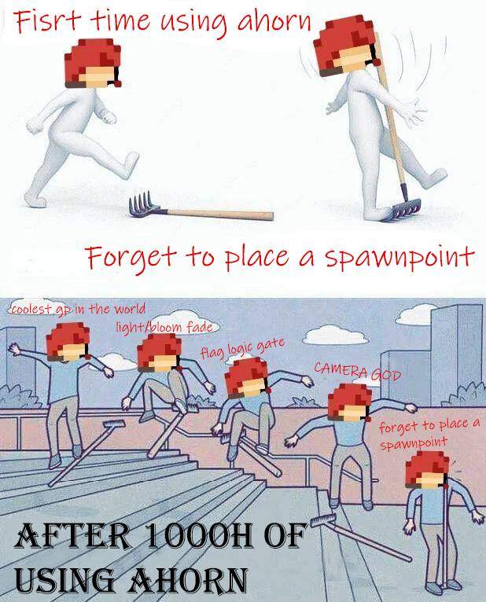
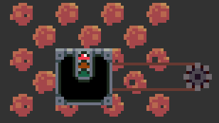
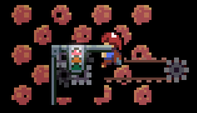
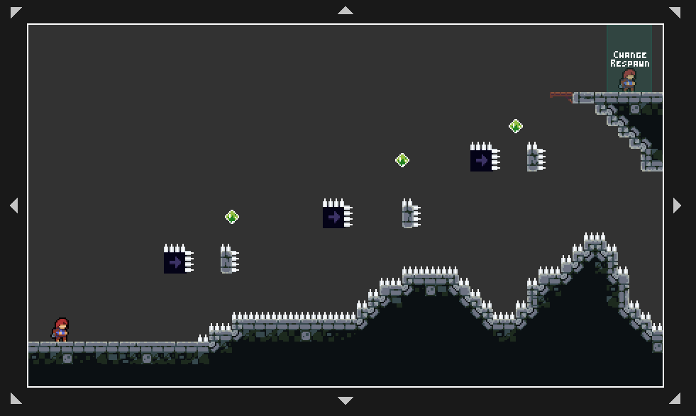

# Loenn 基础

## 组成元素

相信在你的打图经验中肯定会了解不少有关游戏地图组成的元素，一般地，蔚蓝的地图由它的元数据以及所有的面（或者也称为“房间”）组成，而每一面由实体（Entity），触发器（Trigger），以及一系列装饰物和面本身的一些属性等组成。  

- Entity，也就是实体，是地图中比较核心的元素，例如一个红绿灯是一个 Entity，一个草莓是一个 Entity，一块果冻也是一个 Entity。所有能与你互动的东西，大概率就是一个 Entity。
- Trigger，也就是触发器，一般都是对玩家不可见的，就如它的名字，它是用来“触发”一些东西的，当玩家碰到它所占据的长方形区域后就会被“触发”。比如用来改变重生点的 Trigger，用来触发剧情的 Trigger，用来调整镜头的 Trigger 等等。
- Tiles，直译过来是图块，砖块，分为 `Foreground Tiles` 和 `Background Tiles`，前者就是前景砖，后者就是背景砖，前景砖拥有碰撞体积，而背景砖只用来装饰。
- Decals，直译过来是贴花，也分为 `Foreground Decals` 和 `Background Decals` 前景贴花和背景贴花，简单来说它就是一个用来装饰地图的图片。
- Stylegrounds，一种“景”，也分为前景和背景的版本，用于覆盖全屏或整个面的装饰。例如背景图，6A 背景的极光，2ABC 背景的星光等就是背景的 `Stylegrounds`。覆盖整个屏幕的雨，飘的雪，8ABC 的热变形效果等就是前景的 `Stylegrounds`。

这里给个图来实际认识一下：


!!! info "颜色标识"
    红色框内的为实体，浅蓝框内的为前景砖，橙色框内的为背景砖，绿色框内的为前景 Decal，浅紫色框内的为背景 Decal，浅绿色箭头指向的星星就是一种背景 `Stylegrounds`。

当然，官图中已有的元素是满足不了 Mapper 们的制图欲望的，所以就出现了 Helper 这种东西。Helper 也是 Mod 的一种，不过它是一种 Code Mod，即在代码层面对游戏增添了新的内容。在后续介绍一些常见的实体，Trigger 等时同样也会介绍一些常见的位于 Helper 中的东西。

## 房间

### 基础

打开空的地图文件后，首先要做的是创建一个新的面，所以我们在菜单栏中选择 `Room -> Add`：  

  

这里有非常多的属性，这里我们只需要填写 `Room Name` 房间名称，以及 `Width` 和 `Height` 房间的宽和高，这里的宽高单位都是 `tile`，1 `tile` 等于 8 `px`，也就是八个像素大小。在蔚蓝中，镜头的正常大小就是 `40x23 tile`，也就是 `320x184 px`。然后我们点击 `Create Room` 创建房间，不出意外的话房间应该会被创建到你的视野中心。

!!! note "房间名称"
    这里使用了 `a_01` 作为房间名称，这是一种推荐的取名方法，`小节标识_序号`，例如 `a_02` `a_03` `a_03_berry` `b_01` `c_01` `c_alt`，这在后续为你的地图添加 `Stylegrounds` 时提供很大的便利。

在此之前我们不妨认识一下游戏的坐标系。与通常的数学坐标系一样，不过 `y` 轴，也就是纵轴发生了翻转：  


~~GeoGeBra 友情出演~~  

在作图中有两个需要关注的坐标系：全局坐标系和房间坐标系，房间坐标为物体相对于房间左上角原点的相对位置。在游戏中开启了调试模式后可以按下 ++tilde++ 键在左上角的信息框中查看：

<!-- ini 似乎还挺适合这个玩意的显示 -->
```ini
Area: a_01 @ 12 (SID: ThisIsMyName/MyFirstMod/0-MyFirstMap)
Cursor @
  screen: 792, 407
  world:       -89, 524
  level:       39, 332
  level, /8:   4, 41
  level, snap: 32, 328
```

其中 `world` 后面的坐标为光标所在位置的全局坐标，`level` 则是房间坐标，此外还有 `/8` 和 `snap`，前者为房间坐标整除 `8` 的结果，也就是房间 `Tile` 坐标，后者为房间坐标对齐 `8px` 的结果，数值上与 `/8` 的值再乘 `8` 一致。`screen` 则是朴素的光标在屏幕上相对窗口的位置。  
顺便我们还可以说说这个信息框的第一行是什么意思，`Area` 后跟的 `a_01` 为当前所在房间的名字，`@` 后跟的为地图 ID，这个 ID 是随着加载 Mod 的不同而变化的，这个 ID 就可以用于 `load` 指令。再后面则是章节的 SID，这个是相对不变的，只要你不更改地图文件的位置。  

有了这个房间之后，我们就可以来为其添加一些元素了，这里我们先认识一下 Loenn 右侧工具栏都有些什么：

- `Brush`：刷子，用来刷 Tiles
- `Bucket`：填充桶，用 Tile 填充一块区域
- `Circle`：画一块圆形的 Tile
- `Ellipse`：画一块椭圆形的 Tile
- `Line`：画一条直线的 Tile
- `Rectangle`：画一块长方形的 Tile
- `Placement`：放置实体，Trigger，Decal
- `Selection`：选择实体，Trigger，Tile，Decal
- `Room`：与房间相关的操作

每选择了一项后下方的菜单栏也会变化，例如选择了 `Brush` 后会让你选择是涂前景砖还是背景砖，选择了 `Circle` 会让你选择是实心还是空心，选择了 `Placement` 会让你选择是放置实体，放置 Trigger 还是放置 Decal。当选中一项工具后，在房间内使用鼠标左键使用它，例如 `Brush` 模式下长按用来刷出一条砖，`Rectangle` 模式下长按用来放置出长方形的图块。在放置 Tile 时右边会有一栏用于选择 Tile 类型的选项，其中 `Air` 相当于清除 Tile，其余的选项均是游戏本体中出现的 Tile，你可以自行放置来看看它们都分别代表什么。（除了 `Template`，那是一个用来自定义 Tile 的模板，这在后面我们会说到）  

要让你的房间能够正常游玩，至少需要一个 `Player (Spawn Point)`，也就是标识重生点的实体。现在，你可以为你的房间涂上一块作为地板的前景砖，然后选择 `Placement`，在右下角的搜索框中搜索重生点的实体（`Player (Spawn Point)`）并放置，按下保存按钮或者保存快捷键 ++ctrl+s++，在游戏中进入你的第一张地图了。

??? info "记得放重生点"
    ~~当你记得放重生点后你就已经超越大佬了~~  
    

!!! info "勤保存"
    请时刻记得多按按保存，以防突发状况丢掉你的制图进度，此外大多时候你做了一点更改后都要进游戏看效果，此时你也需要保存来让它生效，总之勤保存总没问题。如果你真的很不幸丢失了你的进度，你可以碰碰运气在资源管理器的地址栏敲 `%LOCALAPPDATA%/Loenn/Backups` 或者如果你因为中文用户名的原因使用了带 `--portable` 的 Loenn，到 Loenn 本体目录的 Loenn 里的 `Backups`目录，来看看 Loenn 有没有恰好做了一份你的地图文件的备份。  
    ~在这里为那些丢掉大量进度的人默哀~ ~1~ ~分钟。~

此外是一些基础的操作：使用鼠标右键并拖拽来移动视野，滚动鼠标滚轮来放大缩小视野。当房间太多时可以左键选择旁边的房间列表来快速将视野跳转到对应房间。选中房间时，房间四周会有八个三角形，按住并拖拽它们就能更改房间的大小。在 Loenn 的新版中，放置房间的操作变得更简单了，对比之前你需要反复在菜单栏中选择 `Room->New`，现在我们可以直接选择工具栏中的 `Room` 然后选择 `Place Room` 直接拖拽拉出一个房间来，使用 `Select Room` 来选择一个房间并移动它。  

### 物体

要说制图中重要的东西，那么放置实体，Trigger，Decal，Tile 这些物体是必不可少的。当选择了 `Selection` 工具后，对于大多数物体都有这些操作：

- 左键单击：选择物体
- 再次左键：循环选择光标底下的物体
- 左键拖动：选择多个物体
- 左键拖动已选择物体：移动该物体
- ++shift++ + 左键拖动：将物体加入已选择物体中
- ++ctrl+a++：全选物体
- ++ctrl+c++：复制物体
- ++ctrl+x++：剪切物体
- ++ctrl+v++：粘贴物体
- ++delete++：删除物体（注意不是退格键 ++back++）
- 方向键：移动选中的物体
- ++shift++ + 左键拖动：只允许轴向拖动物体，即只允许上下移动或左右移动
- 对于大多数移动操作，同时按下 ++ctrl++ 键操作时，对齐方式将会使用 `1px` 对齐而不是 `8px`（`tile`）对齐

当实体，Trigger，Decal 被选中时，按下鼠标右键可以打开它的属性窗口从而调整一些物体的参数。例如对于冲刺水晶来说，它有个 `oneUse` 属性决定是否是一次性的，有个 `twoDash` 属性决定是单冲水晶还有双冲水晶。不过记得在更改完属性后按下 `Save Changes` 按钮保存更改，这一点很多人经常忘记。  

对于有大小和方向的实体以及 Decal 和 Trigger，可以拖拽它们的边框来放大和缩小，此外还有如下快捷键：

- ++q++，++e++：减小宽度 / 增大宽度
- ++a++，++d++：减小高度 / 增大高度
- ++l++，++r++：纵向/横向 翻转物体
- ++shift+v++ / ++shift+h++：纵向/横向 翻转选定区域内的物体
- ++l++ / ++r++：逆时针/顺时针 旋转物体

!!! note "`1px` 对齐"
    上述增减长度的快捷键也能按下 ++ctrl++ 来更改为 `1px` 对齐

当然，只有那些支持这样做的物体才能使用这些快捷键。

### 切面

当你拥有多个房间后，你会想让玩家能在多个房间之间切换。\~这很简单\~，你只需要将两个房间靠一起，玩家就能走过去切面了。不过其实只要玩家的速度够在一帧内穿过两个房间之间的空隙就能切面。

## 实体

由于这一小节是在 Loenn 基础里面的，所以这里只会列举不同种类的实体：

- 一般的没有大小的实体：
    - 冲刺水晶：Refill
    - 弹簧：Spring
    - 圆刺：Crystal Spinner
- 有大小的实体（能够进行一些调整大小的操作）：
    - 红绿灯：Zip Mover
    - 果冻：Dream Block
    - 单向板：Jump Through
    - 刺：Spikes
- 有多个节点的实体：
    - 草莓：Strawberry
    - 6AB Badeline Boss：Badeline Boss
    - 新浪：Seeker
- 有固定节点的实体：
    - 果冻：Dream Block
    - 红绿灯：Zip Mover
    - 带泡泡返回的钥匙：Key (With Return)
    - Swap 块：Swap Block

对于允许有多个节点的实体或 Trigger，在选中后按下 ++n++ 键就能向其增加一个新的节点，在选中其节点时按下能向后面再增加一个节点。  
一些实体的节点很容易理解，例如果冻允许拥有的一个节点表明该果冻需要在当前位置和节点间往返运动，新浪的节点表示游荡路径，Badeline Boss 的节点表示每次拥抱后的目的地。而草莓的节点表明这是一个有草莓籽的草莓，草莓实体本体的位置表示最终生成草莓的位置，而它的各个节点表示各个草莓籽的位置。  

上述操作中有一个按住 ++ctrl++ 键来更改对齐方式的操作，不过对于大多数实体来说，一般不建议这样更改，因为很多实体自身的代码都假设了自己的位置和大小都已对齐到 `8px`，例如车，红绿灯等实体，当它们的位置和大小不是 `8px` 对齐时它们的渲染会出现问题（尽管碰撞箱没有问题）。  




## Trigger

这一节你可能会相对陌生，不过它依然很简单。  
Trigger 是一块长方形区域，当玩家进入后会触发一些事情，在 Loenn 中它被显示为一块半透明的绿色长方形。常见的 Trigger 有例如 `Change Respawn Trigger`，当被触发后会将玩家的重生点设置为距离 Trigger 区域中心最近的重生点，此外这个 Trigger 也允许有一个节点，它表示不应使用 Trigger 区域中心这个位置来找最近的重生点而是节点所在位置。一般只有当玩家切面时重生点才会被设置到离玩家最近的重生点实体，所以&#8203;~~为了让玩家不骂你~~&#8203;一般都会在一面的开头和结尾都放上重生点实体，并在结尾放上一个 `Change Respawn Trigger`：  



## Decal

Decal 这一块在操作上非常简单&#8203;~~，在美术上非常困难~~&#8203;，除了位置外它们能更改的属性只有缩放大小，旋转角度，颜色以及图层高低。  
当然，为了简化操作，不要忘记上述的有关更改大小，位置和旋转的按键对 Decal 也有效。&#8203;~~也不要忘记改了属性后要点 `Save Changes` 保存。~~

----

至此，你就掌握了很基础的 Loenn 操作和一些游戏的基础元素。在下面一章会介绍更多有关房间的属性，还有地图的元数据等。

## 参考

Loenn 的菜单栏各按钮功能：

- `File`：文件
    - `New`：新建
    - `Open`：打开
    - `Recent`：最近打开
    - `Save`：保存
    - `Save As`：另存为
    - `Exit`：退出
- `Edit`：编辑
    - `Undo`：撤销
    - `Redo`：重做
    - `Settings`：设置
- `View`：视图
    - `Layers`：控制图层显示
        - `Foreground Tiles`：前景砖
        - `Background Tiles`：背景砖
        - `Entities`：实体
        - `Triggers`：Trigger
        - `Foreground Decals`：前景的装饰物
        - `Background Decals`：背景的装饰物
            - `Trigger Categories`：Trigger 类别
                - `General`：一般的 Trigger
                - `Camera`：镜头相关
                - `Audio`：音频相关
                - `Visual`：视觉相关
    - `Dependencies Only`：只显示依赖的部分
        - `Entities`：在实体列表只显示被依赖 Mod 所有的实体
        - `Trigger`：同上，这里是 `Trigger`
        - `Decals`：同上，这里是 `Decals` （正式作图建议一直开着&#8203;~~，小心别的图的上千个 Decal 干炸了 Loenn~~&#8203;）
    - `Zoom to Extents`：缩放视野使得所有房间都能看见
    - `Metadata`：地图的元数据
    - `Dependencies`：依赖的 Mod
    - `Save Map Image`：给所有房间截图并拼起来，最终大小必须小于 `32767x32767 px`
- `Room`：房间
    - `Add`：新建一个房间
    - `Edit`：编辑当前房间
    - `Delete`：删除当前房间
- `Help`：帮助
    - `Check For Updates`：检查更新
    - `Open Config Directory`：打开配置文件所在文件夹
    - `About`：关于